# 모바일 웨딩 청첩장

임은총 & 김세연 결혼식을 위한 모바일 청첩장 웹앱입니다.

**라이브 링크**: [mobileweddinginvitation.vercel.app](https://mobileweddinginvitation.vercel.app)

## 테마별 샘플 화면

`main` 브랜치는 `VITE_THEME` 환경 변수로 3가지 테마를 지원합니다.

### Modern (기본)

흰 배경 · 베이지 포인트 · Playfair Display

<table>
  <tr>
    <td>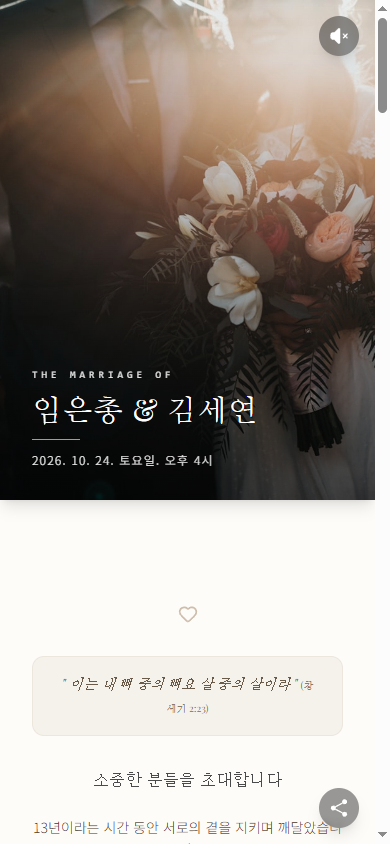</td>
    <td>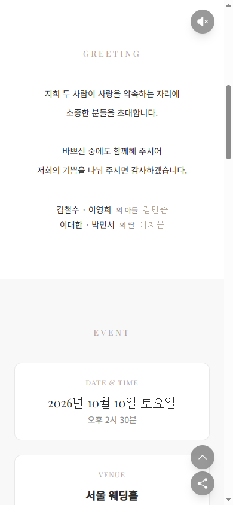</td>
    <td></td>
    <td>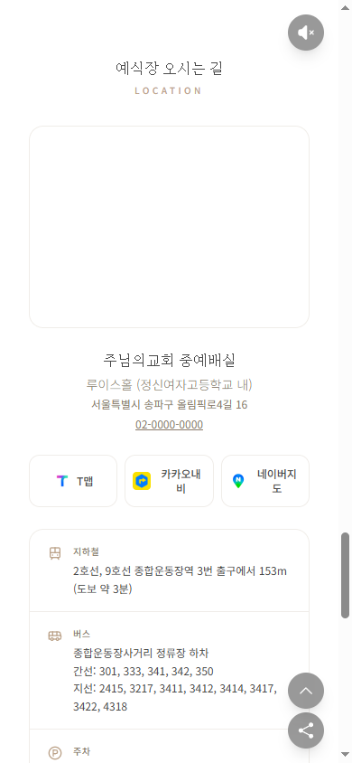</td>
  </tr>
  <tr>
    <td align="center">커버</td>
    <td align="center">인사말</td>
    <td align="center">갤러리</td>
    <td align="center">오시는 길</td>
  </tr>
</table>

### Floral

크림 배경 · 로즈핑크 포인트 · Cormorant Garamond

<table>
  <tr>
    <td>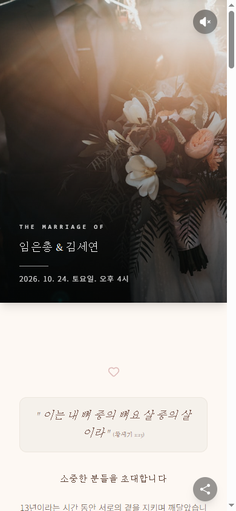</td>
    <td>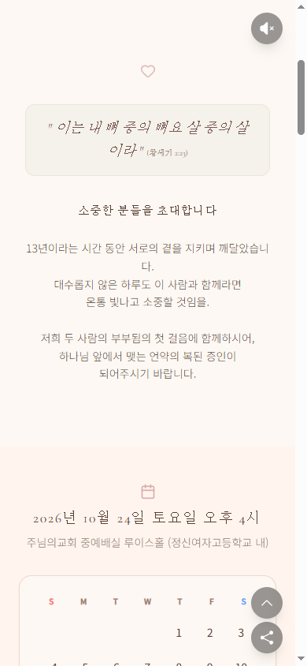</td>
    <td>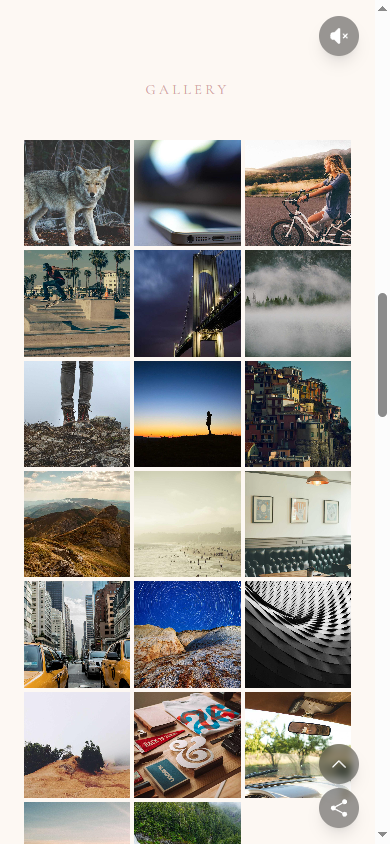</td>
    <td>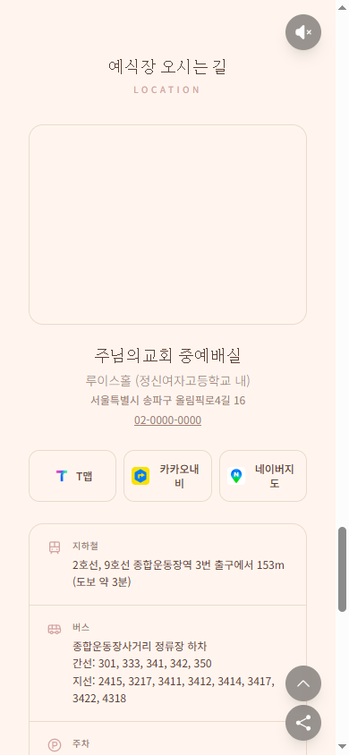</td>
  </tr>
  <tr>
    <td align="center">커버</td>
    <td align="center">인사말</td>
    <td align="center">갤러리</td>
    <td align="center">오시는 길</td>
  </tr>
</table>

### Luxury

다크 배경 · 골드 포인트 · Cinzel

<table>
  <tr>
    <td>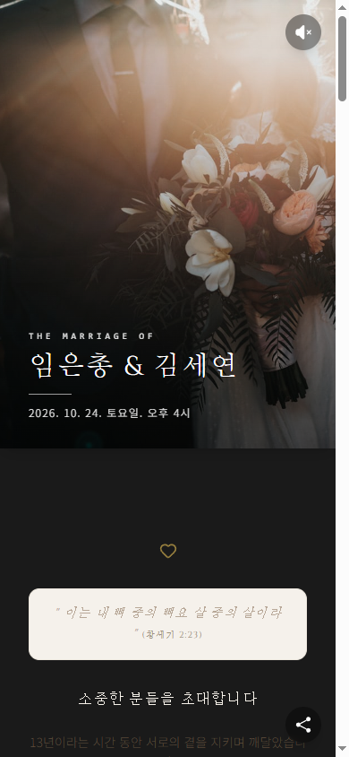</td>
    <td>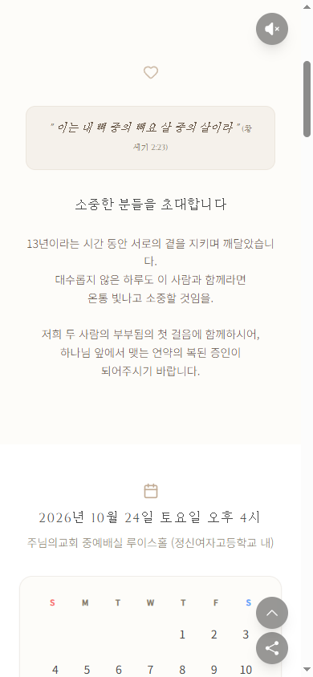</td>
    <td>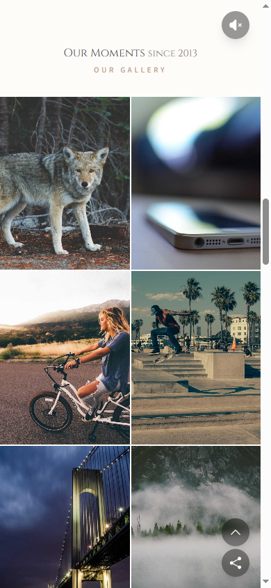</td>
    <td>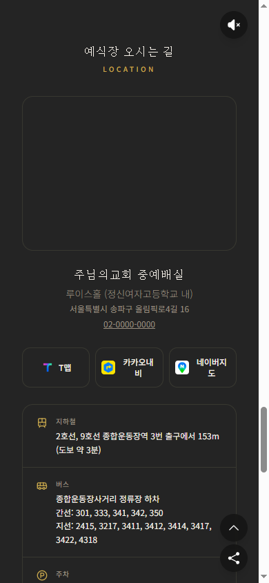</td>
  </tr>
  <tr>
    <td align="center">커버</td>
    <td align="center">인사말</td>
    <td align="center">갤러리</td>
    <td align="center">오시는 길</td>
  </tr>
</table>

## 주요 기능

- **커버** — 웨딩 사진 + 다크 그래디언트 오버레이, 신랑·신부 이름 및 날짜
- **인사말** — 성경 구절 인용, 개인 메시지
- **날짜 · D-day** — 월별 캘린더 위젯, 실시간 카운트다운 타이머
- **혼주 연락처** — 전화 버튼 포함 카드 UI
- **참석 여부 전달** — 카드 버튼 → 인라인 폼 전환 (Formspree 연동)
- **갤러리** — 2열 3:4 비율 그리드, 라이트박스
- **예식장 오시는 길** — 카카오맵 연동, T맵·카카오내비·네이버지도 딥링크, 교통 정보
- **축복의 기도 편지함** — localStorage 기반 방명록
- **마음 전하실 곳** — 신랑·신부측 아코디언 계좌번호 (복사 기능)
- **배경음악** — 토글 가능한 오디오 플레이어
- **공유** — Web Share API

## 기술 스택

| 구분 | 기술 |
|------|------|
| 프레임워크 | Vite + React + TypeScript |
| 스타일 | Tailwind CSS + CSS Variables |
| 아이콘 | lucide-react |
| 지도 | Kakao Maps SDK |
| RSVP | Formspree |
| 배포 | Vercel (`feature/sehyun` 브랜치) |

## 환경 변수

```env
VITE_SITE_URL=https://mobileweddinginvitation.vercel.app
VITE_KAKAO_JAVASCRIPT_KEY=카카오_JavaScript_키
VITE_KAKAO_MAP_APP_KEY=카카오_JavaScript_키
VITE_FORMSPREE_ID=Formspree_폼ID
```

### 카카오톡 공유 배포 설정

Vercel의 Production 환경 변수에 `VITE_SITE_URL`을 등록하고 재배포합니다. 카카오 공유는 Kakao Developers 앱의 **JavaScript 키**를 사용하며, `VITE_KAKAO_JAVASCRIPT_KEY`를 우선 읽고 값이 없으면 기존 배포 호환을 위해 `VITE_KAKAO_MAP_APP_KEY`를 같은 키로 폴백 사용합니다.

Kakao Developers 콘솔의 해당 앱에서 다음 두 항목에 `https://mobileweddinginvitation.vercel.app`를 모두 등록해야 카카오톡 공유 메시지를 친구에게 전송하고, 메시지나 링크를 눌렀을 때 청첩장으로 이동할 수 있습니다.

- **앱 > 플랫폼 > Web > 사이트 도메인**
- **제품 링크 관리 > 웹 도메인**

카카오 공유 버튼은 카카오 JavaScript SDK의 `feed/sendDefault` 템플릿을 사용합니다. 링크 미리보기와 카카오 공유 카드 모두 `https://mobileweddinginvitation.vercel.app/images/og.jpg`를 대표 이미지로 사용하며, 버튼 링크도 같은 배포 URL로 연결됩니다. 배포 후 기존 카카오톡 대화방에 남은 카드는 카카오 캐시를 사용할 수 있으므로, 반드시 새로 공유한 메시지에서 이미지를 확인합니다.

브라우저 탭 아이콘과 모바일 홈화면 아이콘은 `public/favicon.png`, `public/apple-touch-icon.png`를 사용합니다.

## 로컬 실행

```bash
npm install
npm run dev
```
